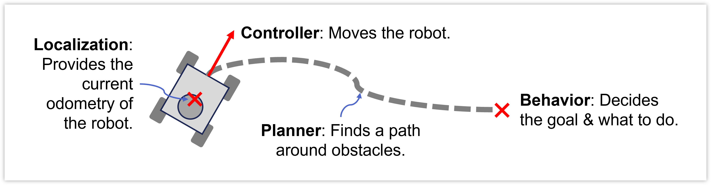
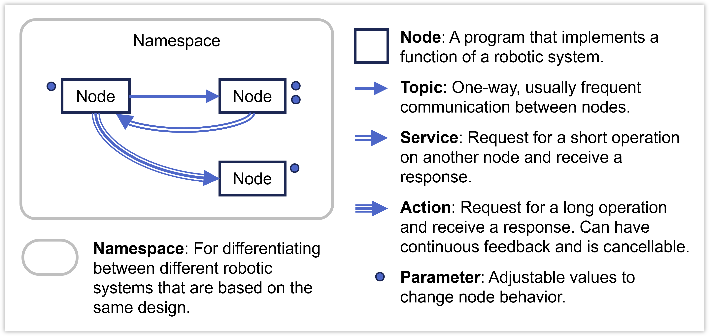
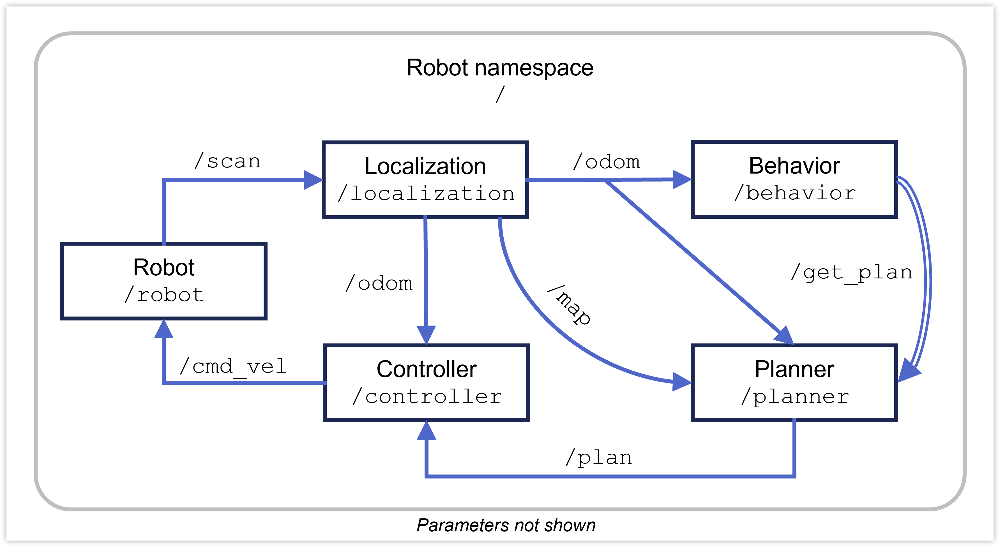
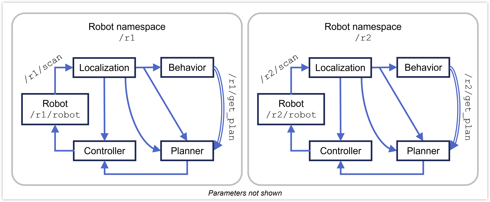

02&emsp;Concepts
==============

***RB2301 Robot Programming***

**&copy; Lai Yan Kai, National University of Singapore**

ROS2 is a suite of software tools for standardizing robotics projects. 
It is widely used by robotics industry and research.
Standardization is critical to facilitate collaboration between different corporate or research groups, and cross-platform compatability between different operating systems and robots.

# Table of Contents

[1&emsp;Background](#1background)

[2&emsp;ROS2 Concepts](#2ros2-concepts)

&emsp;[2.1&emsp;Simple Navigation System Example](#21simple-navigation-system-example)

[3&emsp;Other Related Concepts](#3-other-related-concepts)

# 1&emsp;Background

Consider a simple navigation system that moves a robot from its current position to a destination. The system can be broken down into the following components:

1. **Controller**: Implements an algorithm to follow a path.
2. **Planner**: To find a path that avoids obstacles.
3. **Localization**: Estimates robot odometry (pose & twist). Provides information about dynamic obstacles in this example.
4. **Behavior**: The decision maker. Determines the goal, which is where the robot should go.
5. **Robot**: Interfaces with the hardware sensors and motors.

But what's a good way to program them in a manner that many developers can use? Without software standardization, code development and maintenance becomes difficult between different corporate and research groups. For example, some developers may choose to program all of the functions into one executable process, while others may choose to use different executables running in parallel. Differing development practices can make it difficult for outsiders to improve upon such works.

# 2&emsp;ROS2 Concepts

ROS is a suite of software tools and concepts to **standardize robot software development**. The following lists the high-level (general) concepts used by ROS to standardize the back-end mechanisms for such software.

| Entity / Concept | Description |
|-|-|
| **Node** | A software process that implements a critical part of a component in a robotic system. For example, the graphic user interface for a simulation, or an implementation of a controller algorithm. |
| **Interfaces** | Definitions (templates) for messages sent in services or topics. |
| **Topic** | A message channel to transmit messages between different nodes. For example, a topic `/scan` that allows messages about LIDAR range information to be transmitted. A node can **publish** and/or **subscribe** to messages transmitted within any number of topics. |
| **Service** | A way to request nodes to perform a quick action that returns a response. A node that requests an action is called the **client**. A node that processes this action is called the **service**. The action is typically computationally intensive and may not be sent regularly. The client node and service node can choose to perform other more critical tasks (asynchronously) while the service is being requested.
| **Actions** | A way to request a node to perform a time-consuming function. The **action client** requests for the action, while the **action server** performs the time-consuming action. Uses topics and services under the hood. Actions can be cancelled by either the client node or server node, and the server node can be allowed to return a "failed" result. |
| **Parameters** | Modifiable values that can be passed into nodes to alter the nodes' behavior. For example, adjusting the proportional gain of a PID controller node. Typically, a `yaml` file containing the parameter values are passed into every node at the start of system operation. |
| **Namespaces** | Namespaces help to differentiate between copies of the same system running at the same time, so data transferred within the systems arrive at their intended destinations. This is done by prepending a unique namespace name to the names of all entities (nodes, topics, etc.) within every system. |
| **Launch Files** | For launching multiple nodes at the same time. A robot system consists of multiple nodes. Instead of opening a terminal for every node, a launch file can be written to run all of them at once. Launch files can accept arguments to customize the launches, and are typically used to start robotic systems. |

# 2.1&emsp;Simple Navigation System Example
Using these concepts, we can implement the basic navigation system above with ROS. Each component (robot, controller, planner, localization, behavior) is a ROS node, and every node can communicate with each other using ROS topics, ROS services, or ROS actions (actions are not required for this example). Every node can be tuned or configured slightly differently using ROS parameters. 

The above illustrates the system for one robot. Notice that multiple nodes must be run concurrently in order for the system to work. This concurrency can be achieved by launching these nodes together using one convenient launch file.

Suppose an identical robot is made to run as part of a larger fleet of robots. Since the hardware is identical, it makes sense to reuse the ROS system for this new robot. Since using the same ROS system causes duplicate entity (nodes, topics, services, and actions) names, we use namespaces to differentiate between these robots so all information can arrive at their intended destinations. As mentioned, namespaces prepend all exiting entity names with a unique namespace name to differentiate the systems.

All in all, ROS intentionally creates a bureaucratic standard so we can have:
1. **Clarity**: we know what each component does or does not do.
2. **Modularity**: by keeping the expectations clear, we can pick and choose which components to use for our system.
3. **Maintainability**: clarity also makes it easier for us as software developers to maintain the code.
4. **User-friendliness**: the standards encapsulates (hides) difficult low-level features so it makes it easy for junior developers to use them without worrying about micro-optimization.

# 2&emsp; Software Development Concepts
These concepts will be touched on when we begin coding later in the course.
| Concept | Description |
|-|-|
|**Workspace**| The folder containing the entire ROS2 project of the robotic system. |
|**Package**| A collection of files typically implementing a major component or related components of a robotic system. For example, a package containing files for simulation, motion controlling, or localization. |
|**Configuration Files**| Files specifying how a project and its packages should be built and run. Such files can decide which C++ code and libraries to use to make software (`CMakeLists.txt`), decide how the Python scripts should be run (`setup.py`), and determine the ROS2 dependencies required by a package (`package.xml`). |
|**Command Line Interfaces (CLI)**| Commands on the terminal used to run software. |

# 3&emsp; Other Related Concepts
In ROS2, there are other concepts that are important for robotics development. The non-exhaustive list below lists some of it:

| Concept | Description |
|-|-|
|**Lifecycles**| Standards for state transitions when entities initialize, shutdown, start running, or become idle. |
|**Node composition**| Multiple nodes are launched from the same executable to take advantage of faster intra-process communication. |
|**tf2 tree**| A topic that describes coordinate frame transformations within a robot when it is running. Many tools depend strongly on the tree to track joint states and robot positions. |
|**Description formats**| Specifically, the URDF and SDF formats, for defining the coordinate frames, joint types, and initial transformations on a robot. The SDF format is maintained by the Gazebo simulator developers, which builds upon the URDF by describing sensor behaviors for simulation. | 
|**Simulations**| The caveats of setting up a simulation files for simulation. |
|**Sensor Interfacing**| The caveats of serializing data over data ports. |
|**Bringups**| The convention of starting an entire robot hardware and the names for certain common functionalities (`teleop`, `bringup`, `run` etc. |
|**Standard practices in coding**| The standard practices when coding Python or C++, which are used by ROS2. |

