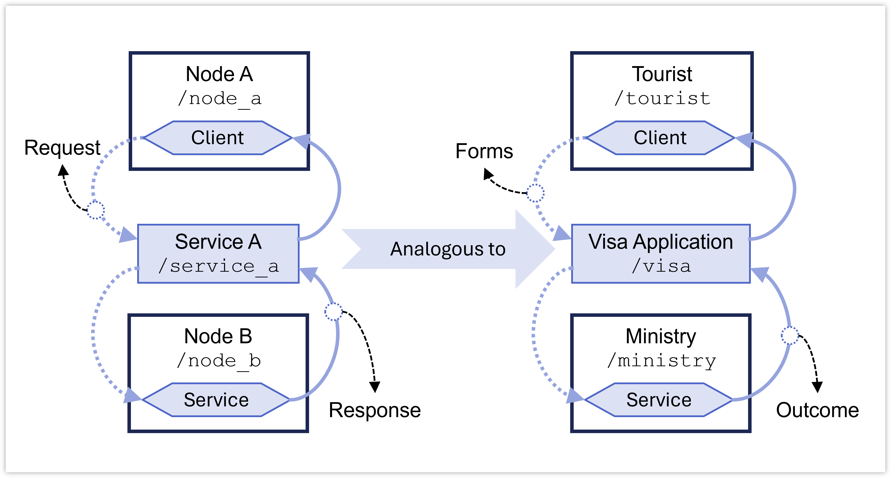

03&emsp;Command Line Interfaces (CLI)
==============

***RB2301 Robot Programming***

**&copy; Lai Yan Kai, National University of Singapore**

A ROS2 robot system is typically made up of many executables that can be run from the command line. 
The commands that diagnose, troubleshoot and execute a system in ROS2 are called the command line interfaces (CLI).
In this chapter, we relate the ROS2 concepts from the previous chapter to the ROS2 CLI to better understand the concepts.

The `turtlesim` node will be used in this chapter to demonstrate the ROS2 CLI and concepts. This section is adapted from the official online ROS2 tutorials.  

A useful cheat sheet for CLI may also be found at https://github.com/ubuntu-robotics/ros2_cheats_sheet/blob/master/cli/cli_cheats_sheet.pdf.

# Table of Contents

[1&emsp;Run](#1run)

[2&emsp;Nodes](#2nodes)

[3&emsp;Interfaces](#3interfaces)

[4&emsp;Topics](#4topics)

[5&emsp;Services](#5services)

[6&emsp;Actions](#6actions)

[7&emsp;Parameters](#7parameters)

[8&emsp;Launch](#8launch)


# 1&emsp;Run
|| Command | Description | 
| - | - | - |  
| 1. | `-h` | Append this to commands to see hints and additional options. |
| 2. | `ros2 run a_pkg an_executable` | Runs an executable called `an_executable` from the ROS2 package `a_pkg`. The executable typically only runs one node (when there is no node composition). |
| 3. | `ros2 run a_pkg an_executable --ros-args ...` | Nodes can be run with ROS2 arguments such as ROS2 parameters. See https://docs.ros.org/en/jazzy/How-To-Guides/Node-arguments.html. |
| 4. | `ros2 run a_pkg an_executable --ros-args -r __ns:=/a_namespace` | Starts the node (no composition) and its connected topics, services, and actions in a namespace `/a_namespace`. If a node is called `/a_node` and publishes or subscribes to a topic `/a_topic`, the node will now be called `/a_namespace/a_node` and the topic `/a_namespace/a_topic` is used instead. The namespace **must** start with `/`. |
| 5. | `ros2 run a_pkg an_executable --ros-args -r __node:=the_node` | Renames the node (no composition) to `the_node`.  The name **cannot** start with `/`. |
| 6. | `ros2 run a_pkg an_executable --ros-args -r a_topic:=the_topic` | Remaps the topic `a_topic` used by the node to `the_topic`. Instead of using `a_topic` as originally coded, it now uses the topic `the_topic`. |
| 7. | `ros2 run a_pkg an_executable --ros-args -r ... -r ... -r ...` | All of the above three renames/remaps can be combined by using the `-r` flag. |

The `run` operation starts only one executable, which typically starts only one ROS2 node. 
While one executable can start multiple nodes, this practice is unconventional and may confuse users.

1. To begin, let's open a terminal we now call `A` to run the `turtlesim`:
    ```bash
    ros2 run turtlesim turtlesim_node
    ```
    You should then see the turtle window.

3. On a separate terminal we now call `B`, run a teleoperating node to move the turtle:
    ```bash
    ros2 run turtlesim turtle_teleop_key
    ```
    Follow the instructions on the terminal to move the turtle.

# 2&emsp;Nodes
|| Command | Description | 
| - | - | - |  
| 1. | `-h` | Append this to commands to see hints and additional options. |
| 2. | `ros2 node info /a_node` | Shows topics, services, and actions that are connected to the running node `/a_node`. |
| 3. | `ros2 node list` | Lists all nodes that are currently running. | 

Nodes are a component of a system that performs a well-defined and often critical role in the system. Nodes typically last for the entire operation of the system, or they may be temporary.


A real world example of a system is a country or a school. 
A node would be a ministry in the country, or a department in the school.

1. On a new terminal we now call `C`, use an appropriate command from the above to determine the nodes that are running. Make sure that `A` is running the turtlesim while `B` is running the teleoperation, as indicated in the previous section.

    - **[Q2a]** What is the command to use to determine all the nodes that are running?
    - **[Q2b]** What are the names of the nodes that are running?


# 3&emsp;Interfaces
|| Command | Description |
| - | - | - |
| 1. | `-h` | Append this to commands to see hints and additional options. |
| 2. | `ros2 interface list` | Lists all interface types (topic message types, service message types, action message types) that are currently known. |
| 3. | `ros2 interface package a_pkg` | Lists all interfaces (their types) provided in a known package `a_pkg`. |
| 4. | `ros2 interface packages` | Lists all packages that are known to provide interfaces. |
| 5. | `ros2 interface type an_interface_type` | Shows all the fields in an interface type `an_interface_type`. |

In ROS2, interfaces are message templates for topics, services and actions. They do not contain data, but formalizes the way data should be organized in a message.

Real world analogues are mass-mailing templates, the forms we fill for government or corporate services, or templates for curriculum vitae and formal letters.

# 4&emsp;Topics
|| Command | Description |
| - | - | - |
| 1. | `-h` | Append this to commands to see hints and additional options. |
| 2. | `ros2 topic bw /a_topic` | The size (bytes) of messages that are being received by a subscriber per second. |
| 3. | `ros2 topic delay /a_topic` | Shows the latency of messages in the `/a_topic` topic, provided that the messages have a `header` field of the type `std_msgs/msg/Header`. |
| 4. | `ros2 topic echo /a_topic` | Prints all messages that are published into the `/a_topic` topic in real time. |
| 5. | `ros2 topic echo /a_topic --field a_data_field` | Prints only the `a_data_field` property of all messages published into the topic `/a_topic` in real time. |
| 6. | `ros2 topic find lib/msg/Type` | Determines from the existing topics which topics will transfer messages of the type `lib/msg/Type`. |
| 7. | `ros2 topic hz /a_topic` | The number of messages per that are being received by a subscriber per second. | 
| 8. | `ros2 topic info /a_topic` | Displays the message type transferred in the `/a_topic` topic, and the number of subscribers and publishers connected to the topic. |
| 9. | `ros2 topic info /a_topic -v` | Displays additional information about the QoS settings of all publishers and subscribers. |
| 10. | `ros2 topic list` | Displays all topics that are being published to or subscribed to. Messages may not have been published into the topics yet. |
| 11. | `ros2 topic pub /a_topic lib/msg/Type "{...}"` | Publishes the same message every second into the `/a_topic` topic. The message is of type `lib/msg/Type` containing some contents `"{...}"`. See `-h` for more options. It is rare to use this CLI command. |
| 12. | `ros2 topic type /a_topic` | Displays only the message type transferred in the `/a_topic` topic. |

Topics are used for rapidly and regularly broadcasting messages.
A **topic** is the channel where the messages are published.
A **publisher** publishes messages into the topic, while a **subscriber** listens to the message that were published into the topic.
Topics are best used for frequent, regular updates between different nodes.

In a ROS2 system, topics are used to transmit data frequently between different nodes. For example, a localization node may broadcast the robot's pose over the `/odom` topic, a camera node may transmit a camera feed over the `/camera` topic, and a LIDAR node can transmit range information over the `/scan` topic. These information are then used by other nodes to perform certain actions.  


A real world analogy of a *topic* is the avenue where you receive the news: a newsstand, a social media account, or your email account. 
The *message* is the newsletter itself. 
The *publisher* and *subscriber* are self explanatory.
Note that after receiving the newsletter, no reply to the publisher is required, and the news is received regularly every day.

In ROS, the message template is defined in a `.msg` interface file. 

1. Make sure `A` and `B` are running the turtlesim and teleoperation respectively. Using a `ros2 topic` command from the table above, determine all the topics that are active.
    - **[Q4a]** What is the command?
    - **[Q4b]** What are all the topics?

2. Now, try to teleoperate with the arrow keys in `B`. With some investigation using the appropriate `ros2 topic` command in `C` to print out all messages passed into a topic, determine the following: 
    - **[Q4c]** What is the command?
    - **[Q4d]** What is the topic that passes velocity messages to move the turtle?
    - **[Q4e]** What is the topic that contains information about the turtle's position and orientation?

3. Using an appropriate `ros2 topic` command, determine the topic's message type, name of the publisher node, and name of the subscriber node for the topics.
    - **[Q4f]** What is the command to investigate say a topic `/a_topic`?
    - **[Q4g]** What is the message type of the topic that passes velocity messages to move the turtle?
    - **[Q4h]** What is the name of the publisher node that publishes the velocity messages?
    - **[Q4i]** What is the message type of the topic that passes the turtle's position and orientation?
    - **[Q4j]** What is the name of the publisher node that publishes the turtle's position and orientation?

4. Determine which of `ros2 interface` command shows the data fields of topic's message type.
    - **[Q4k]** What is the command to show the fields in the message type in **Q4g**?

5. Suppose a message with the type `lib/msg/Type` used by a topic `/a_topic` has the following fields:
    ```
    Point position:
      float64 x 
      float64 y
      float64 z
    Point orientation:
      float64 x
      float64 y
      float64 z
    ```
    To publish the message **once**, the following command can be used:
    ```bash
    ros2 topic pub -1 /a_topic lib/msg/Type "{position: {x: 0.0, y: 0.0, z: 0.0}, orientation: {x: 0.0, y: 0.0, z: 0.0}}"
    ```
    Notice the nested curly braces for nested fields.
    - **[Q4l]** What is the command to move the turtle at 1 unit/s for $x$ and $y$, and rotate 1.0 rad/s about the $z$ axis (yaw)?

    


4. Stop the nodes in `A` and `B` by pressing `Ctrl+C` in both terminals. 
Both nodes will stop running, which you can verify with the appropriate command. 
Then, using the same command to find all active topics, determine the global topics that are *always active*, regardless of any running nodes.
    - **[Q4m]** What are the global topics that are always active?

3. When done, rerun the nodes in `A` and `B`. Use the up-arrow key on both terminals to see the previously-run command.

# 5&emsp;Services
| | Command | Description |
| - | - | - |
| 1. | `ros2 service call /a_service lib/srv/Type "{...}"` | Calls a service `/a_service` with the interface type `lib/srv/Type` that contains the request `"{...}"`. |
| 2. | `ros2 service echo /a_service` | Prints out all requests and responses in the `/a_service` service, provided that introspection is enabled over the service. |
| 3. | `ros2 service find lib/srv/Type` | Determines from the existing services which services will use the interface type `lib/srv/Type`. |
| 4. | `ros2 service info /a_service` | Displays the interface type of the `/a_service` service, and the number of client nodes and service nodes connected to the service. |
| 5. | `ros2 service list` | Lists all existing services. |
| 6. | `ros2 service type /a_service` | Displays the interface type of the `/a_service` service. |


Services are used for requesting some kind of behavior and/or response from a node. 
A **service** is the channel at which a request and subsequent response are transmitted.
A **service client** (more commonly called a *client*) performs a request over this service. 
A **service server** (or more commonly called a *service*) processes the request, and may send back a response.
Services are best used for requesting a complicated task that requires a short but significant time to process (between a few tens of milliseconds to about one or two seconds long). 
Another use case is when the request requires a response.

In a ROS2 system, services are used for requesting complex operations, like requesting a path from a path planning node, spawning multiple robots in simulation, or to synchronizing behaviors between different nodes.



A real world analogy of a *service* is the application process of a tourist visa. 
The *service server* is the ministry providing the service, while the *service client* is the individual applying for the visa. 
The *request* are the application forms the individual have to fill, while the *response* is the outcome of the application sent by the ministry. 
Note that the forms and subsequent outcome are templates that the individual or ministry fills. These templates ensure clear requests and responses between both parties. 

In ROS, to ensure that the request and response templates are easy to find, the templates are typically defined in the same `.srv` interface file.

1. Make sure `A` and `B` are running the turtlesim and teleoperation respectively. Using the appropriate command, determine all the services that are running.
    - **[Q5a]** What is the command?
    - **[Q5b]** What are the services that are running?

2. Now, on `C`, we try to use a service to spawn the turtle, using the service `/spawn`. In order to do so, we need to know more about the values to use the service. These values are based on the data fields in `/spawn`'s service interface (message template).
    - **[Q5c]** Use a `ros2 service` command to determine the type of service interface used by the `/spawn` service. What is the command?
    - **[Q5d]** What is the service interface type?
    - **[Q5e]** Using a `ros2 interface` command to determine all the data fields in the service interface. What is the command? 
    - **[Q5f]** The fields above `---` belong to the request, while the fields below belong to the response. Which are the fields that correspond to the response?

3. Suppose the service interface type `lib/srv/Type` used by the `a_service` service looks like this:
    ```
    float32 x
    string name # some comment
    ---
    int32 id
    ```
    To send a request, we can use the following:
    ```bash
    ros2 service call /a_service lib/srv/Type "{x: 12.0, name: a_name}"
    ```
    The command will then send back a response with the field `id`. Notice that the fields used in the command above belong only to the request portion of the message.

    - **[Q5g]** Determine the command to spawn a turtle at $x=2.0$, $y=3.0$, and at zero heading. Label the new turtle with the name `rb2301`.
    
4. Now we try to remove or "kill" the newly spawned turtle. 
    - **[Q5h]** What is the service?
    - **[Q5i]** What is the service interface type?
    - **[Q5j]** What are the data fields corresponding to the request?
    - **[Q5k]** What is the command to remove the newly spawned turtle?


# 6&emsp;Actions
| | Command | Description |
| - | - | - |
| 1. | `ros2 action info /an_action` | Displays the interface type of the `/an_action` action, and the number of client and server nodes connected to the action. |
| 2. | `ros2 action list` | Lists all the current actions. |
| 3. | `ros2 action send_goal /an_action an_action_type "{...}"` | Sends an action goal with the interface type `an_action_type` to the `/an_action` action with the parameters listed in `"{...}"` |
| 4. | `ros2 action type` | Displays the interface type of the `/an_action` action. |


Actions are used for requesting tasks that take a large amount of time to complete. The channel where the task is requested is the **action**.
The **action client** sends a **goal** (performs a request) to the **action server** which tries to reach the goal.
The request can **succeed**, or fail when it is **cancelled** by the client or **aborted** by the server.
Since ROS2 allows programmers handle such failures, errors can be handled graciously by programmers, unlike services.
In addition, regular **feedback** from the server allows the client to keep track of the progress while the server is processing the request.

In a ROS2 system, actions are used for time-consuming operations lasting for more than a few seconds. For example, to move a robot from one position in a room to another.

A real world analogy of an *action* is an engineering project. 
The *action client* is the client who sets the demands (*goals*) of the project.
The *action server* is the engineering team striving to fulfill the demands.
*Feedback* occurs when the engineering team updates the client regularly.
If the client finds a better team or feels that the team is unable to meet the demands, the project may be *cancelled* by the client.
If the team feels that the client is unable to pay for the project, the project may be *aborted* by the team.

See https://design.ros2.org/articles/an_actions.html for more information.

# 7&emsp;Parameters
| | Command | Description |
| - | - | - |
| 1. | `ros2 param delete /a_node a_dyn_param` | Deletes a dynamically generated parameter `a_dyn_param` from the node `/a_node`. Rarely used. |
| 2. | `ros2 describe /a_node a_param` | Describes the data type, constraints and information about the parameter `a_param` from the `/a_node` node. |
| 3. | `ros2 param dump /a_node` | Prints out all the parameters from a node `/a_node` in YAML file format. |
| 4. | `ros2 param get /a_node a_param` | Gets the value in the parameter `a_param` from the node `/a_node`. |
| 5. | `ros2 param list` | Lists all parameters from all existing nodes. |
| 6. | `ros2 param load /a_node a_path_to_yaml_file` | Loads a YAML file containing parameters for the node `/a_node` at the path `a_path_to_yaml_file`. The YAML file can contain parameters for other nodes as well. | 
| 7. | `ros2 param set /a_node a_param a_value` | Sets a parameter `param` in the node `/a_node` with the value `a_value`. The value is YAML-interpreted, so if `a_value` is `true` or `on`, the value is interpreted as the boolean `true`. If the parameter needs to accept the string `on` instead of a boolean value, use `"'on'"` instead. |

Parameters are adjustable values that alters how nodes behave. These values can be strings, numbers, boolean values, and their array equivalents.
Parameters are typically **declared** by nodes to indicate that values will be passed to them at some point in time during their run-time.
ROS2 **sets** the parameter values based on user input, and the nodes **gets** (read) the parameters while running.

In ROS2, parameters are typically used to tune a robot system's performance (e.g. PID gains), ensure that different parts of the system are connected (e.g. topic names), determine the modular structure of the robotic system (e.g. plugins or nodes to run), etc.
Parameters are typically set in bulk from a **YAML file** in ROS2.

In most applications, nodes only read the parameters at the *beginning of the nodes' run-time*. 
It is possible for nodes to read changes to the parameters during run-time, but this is uncommon because a robotic system is already well-tuned before being released for production (and thus rendering any changes during run-time unnecessary), or because undesirable robot behaviors can arise when parameters change.

There are many real world analogies to parameters, which are adjustable values. 
For example, changing the speed at which a car is cruising down the highway, or setting the temperature of the water heater before showering.


1. Make sure that `A` is running the turtlesim. Using the appropriate `ros2 param` command, determine the first four  parameters from the node `turtlesim`.
    - **[Q7a]** What is the command?
    - **[Q7b]** What are the first four parameters of `turtlesim` node?

2. Set the blue channel of the background in turtlesim.
    - **[Q7c]** Determine the command to describe the parameter that sets the background's blue channel.
    - **[Q7d]** Determine the command to change the blue channel parameter to `0`.


# 8&emsp;Launch
| | Command | Description |
| - | - | - |
| 1. | `ros2 launch a_pkg the_launch_file` | Launches nodes or other launch files based on instructions  from the launch file `the_launch_file`. The launch file is located in the package `a_pkg`. |
| 2. | `ros2 launch a_pkg the_launch_file arg1:=value1 arg2:=value2` | Launch file may specify some launch arguments. Here, the launch arguments are `arg1` and `arg2`. They are launched with the values `value1` and `value2` respectively. |
| 3. | `ros2 launch a_pkg the_launch_file --show_args` | Shows the available arguments for the launch file. |

The `launch` command launches multiple executables or other launch files from a single launch file. 
Since a robot system can be made up of many interacting nodes, it is efficient to write instructions to launch all of these nodes at once.

1. Close all running ROS2 applications with `Ctrl+C`.

2. On `A`, Launch two turtlesim nodes with:
    ```bash
    ros2 launch turtlesim multisim.launch.py
    ```
    - **[Q8a]** Determine the nodes that are running.
    - **[Q8b]** Compare the current node names to the node names from the previous sections. Then, determine the namespaces to differentiate the two turtlesim nodes.
    
3. Begin teleoperating for the first turtlesim. However, starting turtlesim without the appropriate namespace will cause the teleoperating node to publish into the wrong topic.
    - **[Q8c]** Determine the correct topic for the first turtlesim to publish velocities into.
    - **[Q8d]** Determine the `ros2 run` command that starts the teleoperation in the correct namespace for the first turtle. If correctly run, the first turtle will move when teleoperated.
    - **[Q8e]** Determine the command that starts the teleoperation for the second turtle. 

4. Remapping the topics using the `ros2 run` can also be done, although it is not good practice for nodes from different namespaces to communicate with each other (this can create bugs). Nevertheless,
    - **[Q8f]** Without changing the namespace, determine the `ros2 run` command that remaps the topic of the teleoperation node so that the first turtle can be teleoperated.

    - **[Q8g]** Similarly, determine the command for the second turtle.
