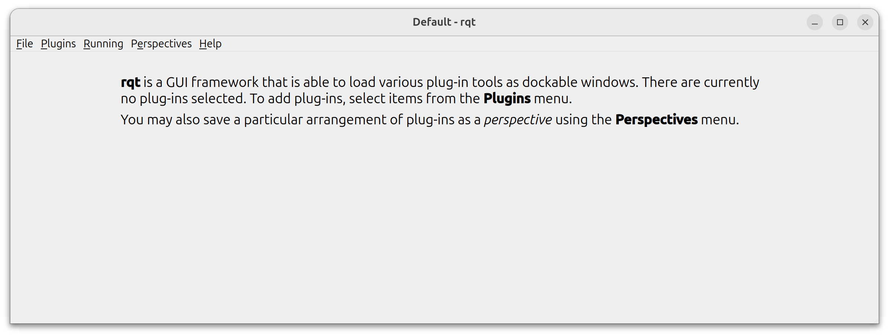
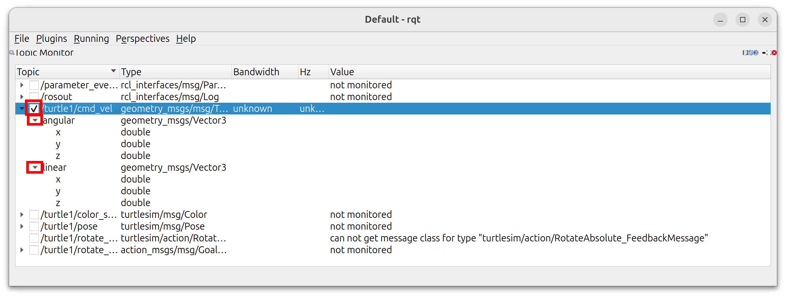
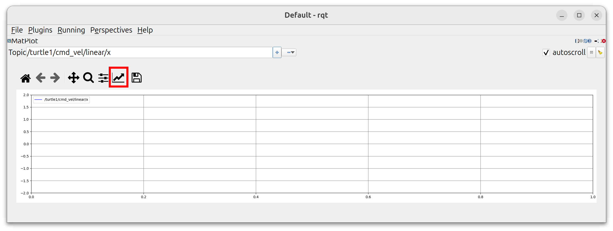
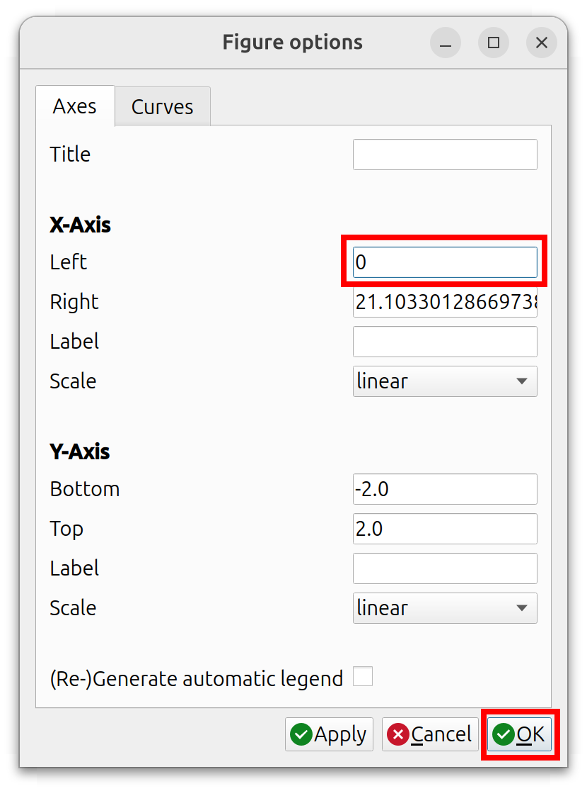
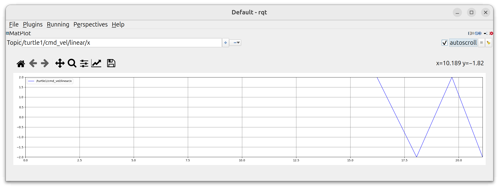
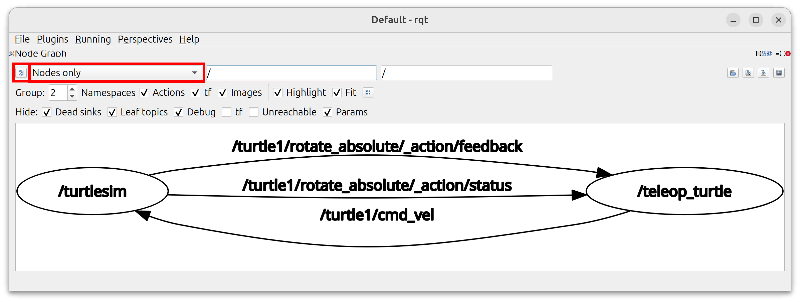

06&emsp;Logging and Recording
==============

***RB2301 Robot Programming***

**&copy; Lai Yan Kai, National University of Singapore**

This chapter discusses two frequently encountered concepts while managing data in software development.

The first is **logging**, which is typically used for **troubleshooting** code. 
Messages are deliberately inserted in different parts of the code to show information about the parts when the parts are run. 
These messages can be differentiated based on their importance (severity), and can be printed onto the terminal or saved into log files.

The second is **recording**, which is typically used for collecting data from experiments for analysis.

# Table of Contents

[1&emsp;Overview of Methods](#1comparison-of-methods)

[2&emsp;RQt](#2rqt)

&emsp;[2.1&emsp;Topic Monitor](#21topic-monitor)

&emsp;[2.2&emsp;Plot](#22plot)

&emsp;[2.3&emsp;Node Graph](#23node-graph)

[3&emsp;ROS2 Bag](#3ros2-bag)

&emsp;[3.1&emsp;Tasks](#31tasks)

[4&emsp;ROS2 Logging](#4ros2-logging)

&emsp;[4.1&emsp;Basic Logging With Python](#41basic-logging-with-python)

&emsp;[4.2&emsp;Log Files](#42log-files)

&emsp;[4.3&emsp;Changing the Logging Directory](#43changing-the-logging-directory)

&emsp;[4.4&emsp;Changing the Logging Level](#44changing-the-logging-level)

&emsp;[4.5&emsp;Other Options](#45other-options)

&emsp;[4.6&emsp;Tasks](#46tasks)

[5&emsp;Python Functions](#5python-functions)

&emsp;[5.1&emsp;Print](#51print)

&emsp;[5.2&emsp;Write to File and Tabular Format](#52write-to-file-and-tabular-format)

&emsp;[5.3&emsp;Tasks](#53tasks)

# 1&emsp;Overview of Methods

The following table lists the methods in this broad category.

As of writing, RQt may behave unexpectedly. ROS2 bag and ROS2 logging utilities may have missing features or unexpected behavior, but are generally reliable.
The common Python printing and file-writing utilities are recommended for troubleshooting code and saving data.

| | Tool | Description |
|-|-|-|
| 1. | RQt | Used primarily for **quick troubleshooting**. RQt is a graphic user interface for quickly plotting and monitoring data. As of writing, RQt may behave and crash unexpectedly. | 
| 2. | ROS2 Bag | Used primarily for **recording data**. It uses the ROS2 CLI `ros2 bag` commands to record messages sent over topics. Very reliable for playing back messages and storing them in compressed formats. Commonly used for benchmarking purposes. However, data cannot be easily plotted. As of writing, some features documented in `-h` may not be available. |
| 3. | ROS2 Logging | Used primarily for **expert logging**. Consists of ROS2 CLI commands and client library (Python) functions. Simultaneously writes information into log files and prints the information onto the terminal. Useful for troubleshooting code but not for recording data. As of writing, log files from Python nodes can be empty if very few information is logged. | 
| 4. | Common Python Utilities | Easy to use for **simple logging**, **troubleshooting**, and **recording**. Information can be reliably printed and saved to a file. The information can even be formatted to table-friendly formats for easy plotting. |

# 2&emsp;RQt
RQt is a graphic user interface which contains many plugins to quickly plot data. 
RQt is useful if no other plotting tools are immediately available.
For data collection, avoid using RQt. Other methods that save raw data, like ROS2 Bag or Python file-writing functions, should be used.
As of writing, RQt is unstable, and can behave unexpectedly or crash.

For the sections below, we assume that the steps are run:

1. Run turtlesim in terminal `A`.
    ```bash
    ros2 run turtlesim turtlesim_node
    ```
2. Run teleoperation in terminal `B`.
    ```bash
    ros2 run turtlesim turtle_teleop_key
    ```
3. In a terminal `C`, run `RQt`:
    ```bash
    rqt
    ```
    The RQt window, if not previously run, will look like the following:
    

## 2.1&emsp;Topic Monitor
The topic monitor can subscribe to a topic, and display information about the topic and the last received message.

1. Ensure that the turtlesim, teleoperation, and RQt are running in terminals `A`, `B`, and `C` respectively.

2. In RQt, select `Plugins`, `Topics`, and then `Topic Monitor`.

3. Click the checkbox for the topic `/turtle1/cmd_vel` to begin monitoring it, and expand the data fields.

    

    Other topics can be monitored. As of writing, monitoring some of the topics may lead to crashes.

4. Press the arrow keys in terminal `B` to teleoperate the turtle, so that the data is reflected in RQt. 
    - **[Q2a]** Screenshot the RQt window with the last message clearly seen on the topic monitor.

5. When done, close the pane containing the topic monitor with the red `Close` button on the top-right. Do not close the window.

## 2.2&emsp;Plot
The plot can be used to quickly plot a field in a topic.

1. Ensure that the turtlesim, teleoperation, and RQt are running in terminals `A`, `B`, and `C` respectively.

2. In RQt, select `Plugins`, `Visualizations`, and then `Plot`.

3. Let's try to plot the linear $x$ velocities sent by the teleoperation node via the `/turtle1/cmd_vel` topic.

    1. In the `Topic` input box, type `/turtle1/cmd_vel/linear/x`.

    2. Click the green `Add` button on the right to begin plotting the topic. 
        - Other data fields can be plotted simultaneously by adding them. 
        - The topics can be removed by selecting the `Remove` dropdown on the right side of the `Add` button.

    3. Press the arrow keys in terminal `B` to teleoperate the turtle. The plot should now change.
4. To see all the data from the start, 
    1. Click the `Edit axis, curve and image parameters...` button. 

        
    
    2. Change the `X-Axis`, `Left` input to `0`, and click `OK`.

        

    3. Ensure that `autoscroll` is enabled on the top-right, below the `Close` button.

    4. The plot should now follow all inputs from the start.

        


5. **[Q2b]** Screenshot the plot showing **all inputs from the start** for the following data fields from the `/turtle1/cmd_vel` topic:
    - Linear $x$ velocity.
    - Linear $y$ velocity.
    - Angular $z$ velocity.

6. When done, close the pane containing the plot with the red `Close` button on the top-right. Do not close the window.

## 2.3&emsp;Node Graph

The node graph is to quickly visualize all nodes that are currently running in the ROS2 system.

1. Ensure that the turtlesim, teleoperation, and RQt are running in terminals `A`, `B`, and `C` respectively.

2. In RQt, select `Plugins`, `Introspection`, and then `Node Graph`. 

3. The following image should show, provided that the node graph was not run before. Click the `Refresh` button on the top-left if the graph is not updated. Refreshing is necessary if a new node is run after the node graph is opened.

    

4. **[Q2c]** Screenshot the node graph when `Nodes/Topics (all)` is selected in the dropdown box on the top-left.


# 3&emsp;ROS2 Bag
The CLI command `ros2 bag` are used to record messages in topics and store them in a compressed format. The messages can also be played back. The compressed format is useful for storing data for benchmarking in research, such as videos for visual SLAM or trajectories for localization. 
The compressed data cannot be used directly for plotting.

|| Command | Description |
|-|-|-|
| 1. | `ros2 bag -h` | Use `-h` to see all available options. Please take note that some options like recording services may not be working. |
| 2.\* | `ros2 bag record /topic_a /topic_b` | Records the topics `/topic_a` and `/topic_b`, and place the recorded data into an automatically created directory `rosbag2_YYYY_MM_DD-HH_MM_SS`, where `YYYY_MM_DD` is the date, `HH_MM_SS` is the time. |
| 3.\* | `ros2 bag record -o dir_name_a /topic_a /topic_b` | Records the topics `/topic_a` and `/topic_b` and saves the recorded data into the directory `dir_name_a`. |
| 4.\* | `ros2 bag record -a` | Records all topics, and place the recorded data into an automatically created directory like above. |
| 5.\* | `ros2 bag record -o dir_name_a -a` | Records all topics and places the recorded data into the directory `dir_name_a`. |
| 6. | `ros2 bag play dir_name_a` | Plays back the recorded data in the directory `dir_name_a`. Use `ros2 bag play -h` to see more options. |
| 7. | `ros2 bag info dir_name_a` | Shows information about the recorded data in the directory `dir_name_a`. Use `ros2 bag info -h` to see more options. |

\* Stop recording with `Ctrl+C`. 

## 3.1&emsp;Tasks

1. Run turtlesim in a terminal `A`.
    ```bash
    ros2 run turtlesim turtlesim_node
    ```
2. Run teleoperation in a terminal `B`.
    ```bash
    ros2 run turtlesim turtle_teleop_key
    ```
3. **[Q3a]** In a terminal `C`, determine the command that will record all topics into a directory `bag_a`, and begin recording.

4. Stop the recording in terminal `C`, and stop the teleoperation node in terminal `B`.  

5. **[Q3b]** In terminal `C`, determine the command that will playback all the topics from `bag_a`. Verify that the turtle is moving from the playback.
    
6. Remove the `bag_a` directory once you are done.

# 4&emsp;ROS2 Logging

ROS2 has built-in logging capabilities to write output into log files and the terminal. 
The logging capabilities are useful for troubleshooting errors, and are not suitable for collecting raw data.
For complete functionality, the ROS2 CLI and client libraries (Python in this course) may have to be used together. 

Please keep in mind that as of writing, there is unexpected behavior. There needs to be **more than three calls to the logging functions** in order for the messages to be saved properly in log files.

Adapted from https://docs.ros.org/en/jazzy/Tutorials/Demos/Logging-and-logger-configuration.html.

## 4.1&emsp;Basic Logging with Python

The following Python commands are used from a node to do basic logging. More information about logging levels are provided in a later section. 

In the table, `self` refers to a ROS2 Node instance. The code below should be used within a class method in the ROS2 Node class.

| | Code  | Description |
| - | - | - |
| 1. | `self.get_logger().debug('a_message')` | Prints `a_message` into the terminal and logs it the message into a log file. The message is on the `DEBUG` level. |
| 2. | `self.get_logger().info('a_message')` | Similar to above, but the message is on the `INFO` level. |
| 3. | `self.get_logger().warn('a_message')` | Similar to above, but the message is on the `WARN` level, and the printed message on the terminal becomes yellow by default. |
| 4. | `self.get_logger().error('a_message')` | Similar to above, but the message is on the `ERROR` level, and the printed message on the terminal becomes red by default. |

The example below shows how the functions above can be used:
```python
from rclpy.node import Node

class SomeNodeA(Node):
    def __init__(self):
        super.__init__('some_node_a')
        self.timer = self.create_timer(0.5, self.timer_callback)
        self.i = 0

    def timer_callback(self):
        self.i += 1
        self.get_logger().info(f'Logging: {self.i}')
        
def main(args=None):
    rclpy.init(args=args)
    node = SomeNodeA()
    rclpy.spin(node)
    rclpy.shutdown()
if __name__ == '__main__':
    main()
```

## 4.2&emsp;Log Files

Every ROS2 Python node generates a `python3_pid_time.log` file, where `pid` is the process identifier for the executable running the node and `time` indicates the time that the node begins running. 

The file is stored in the logging directory, described in the subsequent section.

As of writing, to generate a non-empty log file from a Python node, please ensure that there are **at least three calls** to any combination of the `.debug()`, `.log()`, `.warn()`, or `.error()` functions.
It is unknown if this is intended behavior.

## 4.3&emsp;Changing the Logging Directory
The logging directory stores log files generated by the ROS2 logging utility. The default directory is located at `~/.ros/log`.

To change the logging directory, we need to use the following CLI commands. The commands must be run on the **same terminal** where the nodes are run, and **before the nodes** are run.
| | Command | Description |
|-|-|-|
| 1. | `export ROS_LOG_DIR=log_dir_a` | Specifies a logging directory at the path `log_dir_a` by setting the environment variable `ROS_LOG_DIR`. If the directory does not exist, it is automatically created. |
| 2. | `export ROS_HOME=home_dir_a` | Specifies a ROS project directory at `home_dir_a` by setting the environment variable `ROS_HOME`. The logging directory will be at `home_dir_a/log`. If both directories do not exist, they are automatically created. If both `ROS_HOME` and `ROS_LOG_DIR` are set, then the logging directory in `ROS_LOG_DIR` is used. |

Since environment variables must be set to change the logging directories, the following commands to set, unset, or print an environment variable are provided for convenience:
| | Command | Description |
|-|-|-|
| 1. | `export ENV_A=some_data` | Sets the environment variables `ENV_A` containing the string `some_data`. |
| 2. | `unset ENV_A` | Clears and removes the environment variable `ENV_A`. |
| 3. | `echo $ENV_A` | Prints the environment variable `ENV_A`. |


## 4.4&emsp;Changing the Logging Level
The **logging level of a piece of information** indicates how important it is.
The more important (or *severe*) a message, the more attention we should pay to it. 
By filtering out less important messages, developers are able to troubleshoot their code more efficiently.
The following lists the logging levels in **increasing** order of importance:
1. `DEBUG`
2. `INFO`
3. `WARN`
4. `ERROR`

The **logging level of the logging utility** acts like a filter that filters out less important information.
Suppose the logging utility is on the `INFO` level. 
Information that is on the `DEBUG` level are not logged and not printed, while information that is on the `INFO`, `WARN`, and `ERROR` levels are logged and printed.
The **default logging level** in ROS2 is `INFO`. 


The log level of a node can be changed in either one of two ways. The first way is via the ROS2 CLI, and the second via the Python library:

- The following table shows the CLI command for changing the logging level of a node before running it.
    | Command | Description|
    |-|-|
    | `ros2 run pkg_a exec_a --ros-args --log-level LEVEL_A` | Set the log level of a node to `LEVEL`, where `LEVEL_A` is `DEBUG`, `INFO`, `WARN`, or `ERROR`. Messages logged from the node that are equally or more important to `LEVEL_A` are logged into a log file and printed to the terminal. |

- The following table shows the Python code for changing the logging level of a node from within it:

    | Code | Description |
    |-|-|
    | `set_logger_level(self.get_logger().name, LoggingSeverity.LEVEL_A)` | Set the log level of a node from within the node's class in Python, where `LEVEL_A` is `DEBUG`, `INFO`, `WARN`, or `ERROR`. `set_logger_level()` and `LoggingSeverity` are imported from `rclpy.logging`.  |

    The example below shows the Python code for setting a node `some_node_a` at the `INFO` logging level:

    ```python
    from rclpy.node import Node
    from rclpy.logging import set_logger_level, LoggingSeverity

    class SomeNodeA(Node):
        def __init__(self):
            super.__init__('some_node_a')
            set_logger_level(self.get_logger().name, LoggingSeverity.INFO)
    ```

## 4.5&emsp;Other Options
Other options like ignoring the first call, throttling the calls (i.e. reducing the rate of logging to avoid repeated information), and output formatting can be found at https://docs.ros.org/en/jazzy/Tutorials/Demos/Logging-and-logger-configuration.html.

## 4.6&emsp;Tasks
[Q4a] to [Q4g] assume that the logging level of the node is not set and the default logging level of `INFO` is used.

1. Create a `logger.py` Python script in the `rb2301_tutorial` package.
    1. In this file, create a new ROS2 node. Label the node as `logger` in the constructor and use the class name `Logger`.
    2. Remember to change the `setup.py`.

2. Create a timer that calls a callback every 0.5s.

3. In the **timer callback** of the `logger` node, determine the Python code to
    - **[Q4a]** Log a message `'this is debug'` on the `DEBUG` level.
    - **[Q4b]** Log a counter on the `INFO` level. The counter increments everytime the timer callback is run.
    - **[Q4c]** Log a message `'warn i'` on the `WARN` level, where `i` represents the value of the counter above.
    - **[Q4d]** Log a message `'an error'` on the `ERROR` level.

4. **[Q4e]** Run the node until the terminal output shows at least **three sets of messages** from each of the four logging levels (i.e. the callback is run three times). Screenshot the terminal output showing these messages.

5. **[Q4f]** Locate the log file, open it, and cut and paste its contents. Let `directory_a` be the path of the directory contain the log file and `file_a.log` be the log file. The following CLI command can be used to print out the log file's contents onto the terminal:
    ```bash
    cat directory_a/file_a.log
    ```

6. **[Q4g]** Which logging level is currently missing from both the printed output and the log file? 

7. **[Q4h]** Determine the Python code to change the logging level of the `logger` node to `WARN`. The code can be placed in the node's constructor. What is the Python code?

8. **[Q4i]** Run the node with this new piece of code, which runs the node at the `WARN` logging level. Find the new log file and cut and paste its contents.

9. **[Q4j]** Which logging level is currently missing from both the printed output and the log file?

# 5&emsp;Python Functions
The Python functions are generally much easier to use for troubleshooting code and collecting data in simple projects. 
The `print` function, file-writing, and tabular file-writing are described.

## 5.1&emsp;Print
As used many times before:

| | Code | Description |
|-|-|-|
| 1.| `print('message')` | Prints the string `'message'` on to the terminal. |
| 2.| `print(f'message{i}')` | Uses an f-string to print the string `'messagej'` where `j` is replaced by the contents of the variable `i`. |
| 3.| `print(f'message{i:7.3f}')` | Like above, but prints the number contained in `i` that is at least 7 digits long with 3 decimal places. See https://docs.python.org/3/tutorial/inputoutput.html#tut-f-strings for more options with formatted strings. |

## 5.2&emsp;Write to File and Tabular Format
The following code shows how to write to a file from within a ROS2 Python node.
| | Code | Description |
|-|-|-|
| 1.| `self.f = open('dir_a/file_a.txt', 'w')` | Opens the file `file_a.txt` for writing. All contents in the file will be overwritten. If `dir_a/` is not specified, the file will be stored at the same directory where the node is run. |
| 2.| `self.f.write('hello')` | Can only be run after `open()` is called. Writes the string `hello` into the file. |
| 3.| `self.f.write('hello\n')` | Same as above, additionally inserting a new line. The `\n` is a line break that indicates a new row if the text is cut and pasted into a table. |
| 4.| `self.f.write('hello\t')` | Same as above but inserts a tab instead. The `\t` is a tab that indicates a new column if the text is cut and pasted into a table. |

The following example shows how to write a table-friendly format into a text file called `recorded.txt`. The text file contains three columns, and multiple rows depending on how many times the timer callback is run.
The contents of the text file can be easily copied into Microsoft Excel or Google Sheets to create a table. 
The file will be written once the node stops running.

```python
from rclpy.node import Node

class SomeNodeA(Node):
    def __init__(self):
        super.__init__('some_node_a')
        self.f = open('recorded.txt', 'w')
        self.timer = self.create_timer(0.5, self.timer_callback)
        self.i = 0

    def timer_callback(self):
        self.f.write(f'{self.i}\t{self.i*2}\t{self.i*self.i}\n')
        self.i += 1
        
def main(args=None):
    rclpy.init(args=args)
    node = SomeNodeA()
    rclpy.spin(node)
    rclpy.shutdown()
if __name__ == '__main__':
    main()
```

## 5.3&emsp;Tasks
1. Create a `recorder.py` Python script in the `rb2301_tutorial` package.
    1. In this file, create a new ROS2 node. Label the node as `recorder` in the constructor and use the class name `Recorder`.
    2. In the node, implement a timer that calls a callback every 0.5 seconds.
    3. Remember to change the `setup.py`.

2. Create a subscriber to the `/turtle1/pose` topic.

3. In the **subscriber callback**, record the `x`, `y`, and `theta` data fields from every received message into a `data.txt` file. The data should be recorded in tabular format. 
The first column should be `x`, the second column should be `y`, and the third column should be `z`. 
A new row should be created for every message.

4. Make sure that the `tutorial` node is modified based on the tasks in the previous chapter in [05_Node.md](05_Node.md). Crucially, the turtle should **move back and forth** when the `tutorial` node is run.

5. Run the following in order starting from the first. 
    1. In terminal `A`, run `turtlesim`.
    2. In terminal `B`, run the `tutorial` node.
    3. In terminal `C`, run the `recorder` node.
    4. Wait for at least 3 seconds after the `recorder` node is run.

6. The `data.txt` file should now be generated at the directory on terminal `C` where the `recorder` node is run from. There should be at least 180 rows with 3 columns in the file, as the `/turtle1/pose` publishes at roughly 60 Hz.

7. Plot the data in `data.txt`.
    1. Cut and paste all the txt from `data.txt` into Microsoft Excel, Google Sheets, or MATLAB.
    2. Insert a figure/chart by selecting the scatter plot. 
    3. Plot each column as one line in the same figure/chart.
    4. Insert a legend to label the three lines.
    5. **[Q5a]** Screenshot the figure/chart.
    
7. **[Q5b]** Cut and paste the contents of `recorder.py`.