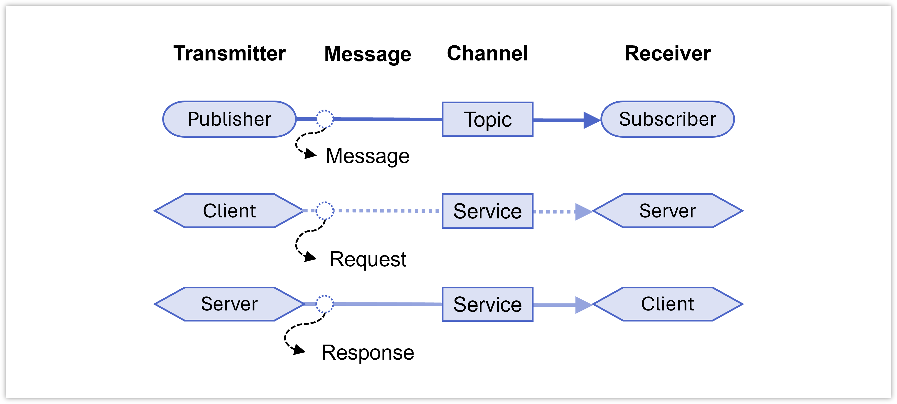

8&emsp;Quality of Service
==============

***RB2301 Robot Programming***

**&copy; Lai Yan Kai, National University of Singapore**

The quality of service determines the communication behavior within services and topics.

Adapted from https://docs.ros.org/en/jazzy/Concepts/Intermediate/About-Quality-of-Service-Settings.html and https://design.ros2.org/articles/qos_deadline_liveliness_lifespan.html

# Table of Contents
[1&emsp;Nomenclature](#1nomenclature)

[2&emsp;QoS Policy](#2qos-policy)

&emsp;[2.1&emsp;Types and Values](#21types-and-values)

&emsp;[2.2&emsp;Transmitter-Receiver Compatibility](#22transmitter-receiver-compatibility)

&emsp;[2.3&emsp;Compatibility Issues for Services](#23compatibility-issues-for-services)

[3&emsp;QoS Profile](#3qos-profile)

&emsp;[3.1&emsp;Customized Profile](#31customized-profile)

&emsp;[3.2&emsp;Preset Profiles](#32preset-profiles)


# 1&emsp;Nomenclature
In this chapter, 


- A **message** refers collectively to a topic message, service request, service repsonse.
- A **handle** refers collectively to a topic publisher, topic subscriber, service client, or service server. A **transmitter** publishes a topic message, or sends a service request or response. A **receiver** receives the topic message or receives a service request or response.
- A **channel** refers to the topic or service that the message is transmitted.


# 2&emsp;QoS Policy
A policy is a rule of communication. It determines how handles behave when receiving or transmitting messages.

## 2.1&emsp;Types and Values
The following table describes the different QoS policies for the messages that are transmitted or received by handles. 

The default values in the last column are listed for the default middleware (Fast-DDS middleware) of ROS2 Jazzy. For the policies with options, the default value is the same as using `SYSTEM_DEFAULT`.

To digress, a **middleware** is the low-level software that implements the high-level functions of ROS2. Think of ROS2 as the internet browser on a phone, and the middleware as the communications tower that provides the mobile internet.

<table><tbody>
    <tr>
        <th></th>
        <th>Policy</th>
        <th>Description and Options</th>
        <th>System Default (Fast-DDS)</th>
    </tr>
    <tr>
        <td>1.</td>
        <td><b>History</b></td>
        <td>
            Indicates how many of the most recent past messages should be kept by the current handle.
            <ul>
                <li><code>KEEP_LAST</code>: The last number of messages, specified in <b>depth</b>, should be kept.</li>
                <li><code>KEEP_ALL</code>: All messages should be kept.</li>
                <li><code>SYSTEM_DEFAULT</code>: Use the default provided by the middleware.</li>
            </ul>
        </td>
        <td><code>KEEP_LAST</code></td>
    </tr>
    <tr>
        <td>2.</td>
        <td><b>Depth</b></td>
        <td>Also known as <i>Queue size</i>. If <code>KEEP_LAST</code> is selected for <b>history</b>, this indicates how many of the most recent messages should be kept.</td>
        <td><code>10</code></td>
    </tr>
    <tr>
        <td>3.</td>
        <td><b>Reliability</b></td>
        <td>
            Determines if it is possible to drop some messages if the network is lossy or slow.
            <ul>
                <li><code>BEST_EFFORT</code>: Similar to the UDP communication protocol, messages will be dropped if it cannot reach the handle in time. This is good for real-time performance in lossy networks, because no extra attempts are made to resend lost data.</li>
                <li><code>RELIABLE</code>: Similar to the TCP communication protocol, where all messages must be transferred. This is good for critical functions like services where losing a single request can cause a system to fail.</li>
                <li><code>SYSTEM_DEFAULT</code>: Use the default provided by the middleware.</li>
            </ul>
        </td>
        <td><code>RELIABLE</code></td>
    </tr>
    <tr>
        <td>4.</td>
        <td><b>Durability</b></td>
        <td>
            <ul>
                <li><code>TRANSIENT_LOCAL</code>: A transmitter handle assigned this policy will persist all of the messages sent by itself (i.e. <b>latched connection</b>). 
                If a receiver handle joins the channel after some messages are sent, the handle will receive all of these past messages from the transmitter.</li>
                <li><code>VOLATILE</code>: Handles will only transmit and store the current message. 
                If a receiving handle joins the channel after some messages are sent, the receiver will not receive any of the past messages.</li>
                <li><code>SYSTEM_DEFAULT</code>: Use the default provided by the middleware.</li>
            </ul>
        </td>
        <td><code>VOLATILE</code></td>
    </tr>
    <tr>
        <td>5.</td>
        <td><b>Deadline</b></td>
        <td><b>[Not in course]</b> The duration in nanoseconds where the transmitter is guaranteed to transmit a message.</td>
        <td><code>0</code> (i.e. infinite, or no deadline)</td>
    </tr>
    <tr>
        <td>6.</td>
        <td><b>Lifespan</b></td>
        <td><b>[Not in course]</b> The duration in nanoseconds between transmitting and receiving when a message is considered to still be usable. If the message is received after the duration has elapsed, the receiving handle drops the message.</td>
        <td><code>0</code> (i.e. infinite, or no lifespan restriction)</td>
    </tr>
    <tr>
        <td>7.</td>
        <td><b>Liveliness</b></td>
        <td>
            <b>[Not in course]</b> The method to determine whether a transmitting handle is active or inactive.
            <ul>
                <li><code>AUTOMATIC</code>: Determined by the middleware. For Fast-DDS, a transmitting handle is automatically signalled as active at every <b>lease duration</b>.</li>
                <li><code>MANUAL_BY_TOPIC</code>: The transmitter handle must explicitly indicate that it is active.</li>
                <li><code>SYSTEM_DEFAULT</code>: Use the default provided by the middleware.</li>
            </ul>
        </td>
        <td><code>AUTOMATIC</code></td>
    </tr>
    <tr>
        <td>8.</td>
        <td><b>Lease Duration</b></td>
        <td>
            <b>[Not in course]</b> The maximum duration in nanoseconds from the last active signal at which a transmitting handle is considered to be active.
        </td>
        <td><code>0</code> (i.e. infinite, or no signalling required).</td>
    </tr>
</tbody></table>

## 2.2&emsp;Transmitter-Receiver Compatibility
The QoS policies for a transmitter and a receiver on the same channel can be set independently. 
The QoS policies of the pair are **compatible** as long as the receiver has an identically or less demanding policy than the transmitter. If so, communication is possible between the pair. 
The QoS policies of the pair are **incompatible** when the receiver needs a more demanding communication policy than the transmitter. In this case, **no communication** occurs.

Only the compatibility for the durability and reliability policies are shown below. Compatibility for policies not taught in this course are not shown (see them at https://docs.ros.org/en/jazzy/Concepts/Intermediate/About-Quality-of-Service-Settings.html).

The following table shows the compatibility for the **reliability policy**. A receiver that has low expectations about receiving all messages (`BEST_EFFORT`) can work with a transmitter that loses some messages (`BEST_EFFORT`). However, a receiver that expects to receive all messages (`RELIABLE`) cannot work with a transmitter that loses some messages (`BEST_EFFORT`).

| Transmitter | Receiver | Compatibility |
|-|-|-|
| `BEST_EFFORT` | `BEST_EFFORT` | Yes |
| `RELIABLE` | `RELIABLE` | Yes |
| `RELIABLE` | `BEST_EFFORT` | Yes | 
| `BEST_EFFORT` | `RELIABLE` | No | 

The following tables shows the compatability for the **durability policy**. 
A receiver that requires past messages (`TRANSIENT_LOCAL`) can work with a transmitter that persists past messages (`TRANSIENT_LOCAL`). 
A receiver that requires past messages (`TRANSIENT_LOCAL`) cannot work with a transmitter that do not persist past messages (`VOLATILE`).

| Transmitter | Receiver | Compatibility |
|-|-|-|
| `TRANSIENT_LOCAL` | `TRANSIENT_LOCAL` | Yes |
| `VOLATILE` | `VOLATILE` | Yes |
| `TRANSIENT_LOCAL` | `VOLATILE` | Yes | 
| `VOLATILE` | `TRANSIENT_LOCAL` | No | 


# 2.3&emsp;Compatibility Issues for Services
As of writing, it is important to **specify identical QoS policies** for both the **service client** and **service server** while using the Python client library.
While initializing a client or server in the node constructor, the same QoS policies are **set together for both the request and the response**: 

| | Code | Description |
|-|-|-|
| 1. | `self.create_client(SrvTypeA, '/service_a', qos_profile=qos_profile_a)` | Code to initialize a service client in the node constructor with the QoS profile `qos_profile_a`, which contains QoS policies. | 
| 2. | `self.create_server(SrvTypeA, '/service_a', self.service_a_callback, qos_profile=qos_profile_a)` | Code to initialize a service server in the node constructor with the QoS profile `qos_profile_a`, which contains QoS policies. |

Since the service client is both a transmitter of requests and receiver of responses, and the server is both a receiver or requests and trasmitter of responses, setting different policies for the client or receiver will cause the service to be unable to communicate in both directions.

For example, if the reliability policy of the client is set to `VOLATILE` and the server is set to `TRANSIENT_LOCAL`, the server is able to receive the request from the client but the client is unable to receive the response from the server.

In summary, independent policies cannot be set for the request and response. Whether this is an overlooked problem or intended design is unknown.


# 3&emsp;QoS Profile

A QoS profile is a collection of QoS policies.

## 3.1&emsp;Customized Profile
In the client library (Python), it is implemented as the `QoSProfile` class. The following table shows how to use keyword arguments in the `QoSProfile` constructor to implement the QoS policies:

<table><tbody>
    <tr>
        <th></th>
        <th>Keyword Argument</th>
        <th>Value</th>
    </tr>
    <tr>
        <td>1.</td>
        <td><code>history=</code></td>
        <td>
            Import the values:
            <pre lang="python">from rclpy.qos import HistoryPolicy</pre>
            Then use any of the following:
            <ul>
                <li><code>HistoryPolicy.KEEP_LAST</code></li>
                <li><code>HistoryPolicy.KEEP_ALL</code></li>
                <li><code>HistoryPolicy.SYSTEM_DEFAULT</code></li>
            </ul>
        </td>
    </tr>
    <tr>
        <td>2.</td>
        <td><code>depth=</code></td>
        <td>
            <ul><li>A positive integer.</li></ul>
        </td>
    </tr>
    <tr>
        <td>3.</td>
        <td><code>reliability=</code></td>
        <td>
            Import the values:
            <pre lang="python">from rclpy.qos import ReliabilityPolicy</pre>
            Then use any of the following:
            <ul>
                <li><code>ReliabilityPolicy.BEST_EFFORT</code></li>
                <li><code>ReliabilityPolicy.RELIABLE</code></li>
                <li><code>ReliabilityPolicy.SYSTEM_DEFAULT</code></li>
            </ul>
        </td>
    </tr>
    <tr>
        <td>4.</td>
        <td><code>durability=</code></td>
        <td>
            Import the values:
            <pre lang="python">from rclpy.qos import DurabilityPolicy</pre>
            Then use any of the following:
            <ul>
                <li><code>DurabilityPolicy.TRANSIENT_LOCAL</code></li>
                <li><code>DurabilityPolicy.VOLATILE</code></li>
                <li><code>DurabilityPolicy.SYSTEM_DEFAULT</code></li>
            </ul>
        </td>
    </tr>
    <tr>
        <td>5.</td>
        <td><code>deadline=</code></td>
        <td>
            Import the <code>Duration</code> class:
            <pre lang="python">from rclpy.duration import Duration</pre>
            Then replace <code>0.5</code> below with the desired duration in seconds:
            <ul><li><code>Duration(seconds=0.5)</code></li></ul>
        </td>
    </tr>
    <tr>
        <td>6.</td>
        <td><code>lifespan=</code></td>
        <td>
            Import <code>Duration</code>:
            <pre lang="python">from rclpy.duration import Duration</pre>
            Replace <code>0.5</code> below with the duration in seconds:
            <ul><li><code>Duration(seconds=0.5)</code></li></ul>
        </td>
    </tr>
    <tr>
        <td>7.</td>
        <td><code>liveliness=</code></td>
        <td>
            Import the values:
            <pre lang="python">from rclpy.qos import LivelinessPolicy</pre>
            Then use any of the following:
            <ul>
                <li><code>LivelinessPolicy.AUTOMATIC</code></li>
                <li><code>LivelinessPolicy.MANUAL_BY_TOPIC</code></li>
                <li><code>LivelinessPolicy.SYSTEM_DEFAULT</code></li>
            </ul>
        </td>
    </tr>
    <tr>
        <td>8.</td>
        <td><code>liveliness_lease_duration=</code></td>
        <td>
            Import <code>Duration</code>:
            <pre lang="python">from rclpy.duration import Duration</pre>
            Replace <code>0.5</code> below with the duration in seconds:
            <ul><li><code>Duration(seconds=0.5)</code></li></ul>
        </td>
    </tr>
</tbody></table>

The example below shows how to implement a topic publisher with a custom QoS profile:

```python
from rclpy.node import Node
from std_msgs.msg import String
from rclpy.qos import (
    QoSProfile, 
    HistoryPolicy, 
    DurabilityPolicy, 
    ReliabilityPolicy
    )

class SomeNodeA(Node):
    def __init__(self):
        super.__init__('some_node_a')

        qos_profile = QoSProfile(
            history=HistoryPolicy.KEEP_LAST,
            depth=10,
            reliability=ReliabilityPolicy.BEST_EFFORT,
            durability=DurabilityPolicy.TRANSIENT_LOCAL
            )

        self.text_pub = self.create_publisher(String, '/topic_a', qos_profile)
        
def main(args=None):
    rclpy.init(args=args)
    node = SomeNodeA()
    rclpy.spin(node)
    rclpy.shutdown()
if __name__ == '__main__':
    main()
```
## 3.2&emsp;Preset Profiles

A QoS profile can have policies that are already tuned for a common communication task. These are called **presets**. The following table lists the presets that can be used directly:

<table><tbody>
    <tr>
        <th></th>
        <th>Profile</th>
        <th>Equivalent Definition</th>
    </tr>
    <tr>
        <td>1.</td>
        <td><code>qos_profile_default</code>: 
        <br/>
        Suited for most use cases.</td>
        <td>
<pre lang="python">
QoSProfile(
    history=HistoryPolicy.KEEP_LAST,
    depth=10,
    reliability=ReliabilityPolicy.RELIABLE,
    durability=DurabilityPolicy.VOLATILE
    )
</pre>
        </td>
    </tr>
    <tr>
        <td>2.</td>
        <td><code>qos_profile_sensor_data</code>:
        <br/>
        Suited for data transmission on lossy networks, as the transmitter is not expected to resend a lost message (<code>BEST_EFFORT</code>). The small depth also helps real-time transmission.</td>
        <td>
<pre lang="python">
QoSProfile(
    history=HistoryPolicy.KEEP_LAST,
    depth=5,
    reliability=ReliabilityPolicy.BEST_EFFORT,
    durability=DurabilityPolicy.VOLATILE
    )
</pre>
        </td>
    </tr>
    <tr>
        <td>3.</td>
        <td><code>qos_profile_services_default</code>:
        <br/>
        Suited for services and are the defaults for the service client and service server handles.</td>
        <td>
<pre lang="python">
QoSProfile(
    history=HistoryPolicy.KEEP_LAST,
    depth=10,
    reliability=ReliabilityPolicy.RELIABLE,
    durability=DurabilityPolicy.VOLATILE
    )
</pre>
        </td>
    </tr>
    <tr>
        <td>4.</td>
        <td><code>qos_profile_parameters</code>, <code>qos_profile_parameter_events</code>:
        <br/>
        Suited for changing parameters during a node's runtime. Note that parameters are updated with service calls.</td>
        <td>
<pre lang="python">
QoSProfile(
    history=HistoryPolicy.KEEP_LAST,
    depth=1000,
    reliability=ReliabilityPolicy.RELIABLE,
    durability=DurabilityPolicy.VOLATILE
    )
</pre>
        </td>
    </tr>
    <tr>
        <td>5.</td>
        <td><code>qos_profile_system_default</code>:
        <br/>
        Uses the middleware defaults for all policies.</td>
        <td>
<pre lang="python">
QoSProfile(
    history=HistoryPolicy.SYSTEM_DEFAULT,
    depth=0,
    reliability=ReliabilityPolicy.SYSTEM_DEFAULT,
    durability=DurabilityPolicy.SYSTEM_DEFAULT,
    )
</pre>
        </td>
    </tr>
    <tr>
        <td>&mdash;</td>
        <td>
        For all presets above, the values for the other policies are:</td>
<td><pre lang="python">
QoSProfile(
    # ...
    lifespan=Duration(seconds=0),
    deadline=Duration(seconds=0),
    liveliness=LivelinessPolicy.SYSTEM_DEFAULT,
    liveliness_lease_duration=Duration(seconds=0)
    )
</pre>
        </td>
    </tr>
</tbody></table>

The example below shows how to use a preset QoS profile. Note the additional **import** statement:

```python
from rclpy.node import Node
from sensor_msgs.msg import LaserScan
from rclpy.qos import qos_profile_sensor_data # import

class SomeNodeA(Node):
    def __init__(self):
        super.__init__('some_node_a')

        self.scan_sub = self.create_subscription(
            LaserScan, 
            '/scan', 
            self.scan_sub_callback, 
            qos_profile_sensor_data # use profile directly
        ) 

    def scan_sub_callback(self, msg):
        self.scan_msg = msg
        
def main(args=None):
    rclpy.init(args=args)
    node = SomeNodeA()
    rclpy.spin(node)
    rclpy.shutdown()
if __name__ == '__main__':
    main()
```
